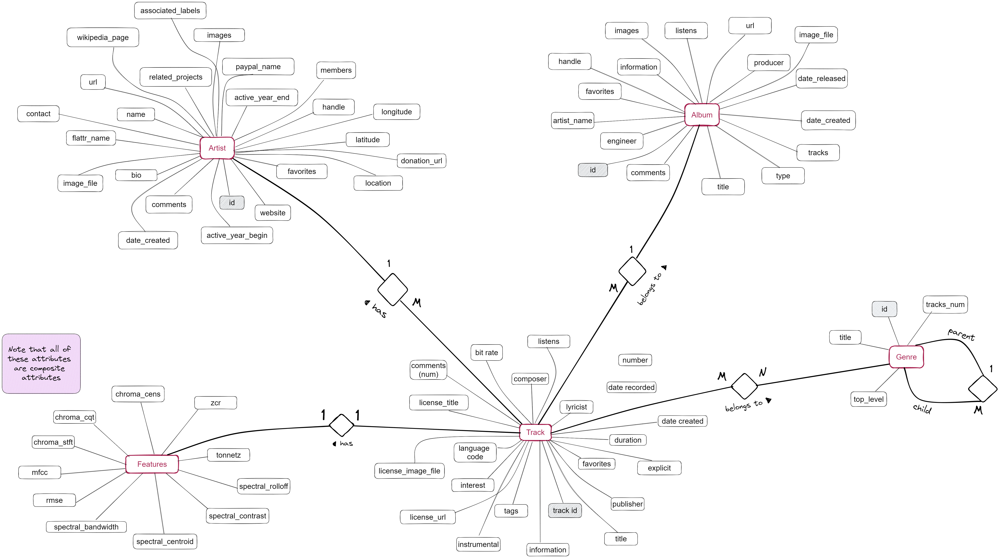

###
## Introduction

This project focuses on analyzing the [FMA](https://arxiv.org/pdf/1612.01840.pdf) dataset, primarily emphasizing multi-class genre classification. The outcomes are documented in notebooks which could be categorized as follows:
- Preprocessing
  - `metadata_EDA.ipynb`
  - `audio_features_EDA.ipynb`
  - `dataset_creation.ipynb`
- Clustering
  - `clustering.ipynb`
  - `dbscan_clustering.ipynb`
- Classification
  - `generative_classifiers.ipynb`
  - `tree_based_classifiers.ipynb`
  - `knn_classifier.ipynb`
  - `logistic_regression.ipynb`
  - `MLP.ipynb`
- Regression
  - `linear_regression.ipynb`

Additionally, a small utility package has been included, that contains classes and functions designed to enhance code readability within the notebooks and to minimize code repetition. This is especially useful given the experimental approach used, involving training and testing multiple classifiers on various subsets of the dataset.

## Database




As shown in the diagram above, the dataset encompasses extensive metadata and extracted features for each track. Regarding the audio features (used for the Music Information Retrieval tasks in this project), they are composite features, combining multiple coefficients with descriptive statistics for each coefficient.

The following table outlines the composite audio features (the 7 values include the four moments of the distributions as well as median, minimum, and maximum):

| Feature             | Attributes Measured | Total Values |
|---------------------|---------------------|--------------|
| chroma_cens         | 12                  | 84           |
| chroma_cqt          | 12                  | 84           |
| chroma_stft         | 12                  | 84           |
| mfcc                | 20                  | 140          |
| rmse                | 1                   | 7            |
| spectral_bandwidth  | 1                   | 7            |
| spectral_centroid   | 1                   | 7            |
| spectral_contrast   | 7                   | 49           |
| spectral_rolloff    | 1                   | 7            |
| tonnetz             | 6                   | 42           |
| zcr                 | 1                   | 7            |

The diagram below illustrates how each of these features is measured. Essentially, the song is divided into discrete frames, and for each frame, the relevant values are measured. Subsequently, descriptive statistics summarize these values (across the temporal component).


<span style="background-color: #E8E8E8; border-radius: 3px; padding-left: 1rem; padding-right: 1rem;">You can download the dataset [here](https://os.unil.cloud.switch.ch/fma/fma_metadata.zip) (342 MiB).</span>


## Methodology
### Preprocessing
- Initially, metadata was employed to filter tracks of interest based on specific criteria, including: track duration, sound quality, song popularity, type of recording etc. (code available in `metadata_EDA.ipynb`)
- Audio features were analyzed, involving tasks like cleaning, outlier detection, addressing class imbalance, etc. (code available in `audio_features.ipynb`)
- Lastly, for experimental purposes, eight distinct feature subsets were created. These subsets determine the features utilized from the dataset for training and evaluating classifiers (code available in `datasets_creation.ipynb`)
  - *Modified train set refers to the train set on which operations like under/over-sampling were performed (to address class imbalance)*


- The classifiers trained and evaluated include:


## References
- <a href="https://arxiv.org/pdf/1612.01840.pdf">Dataset Creation</a>
- <a href="https://arxiv.org/pdf/1106.1813.pdf">SMOTE: Synthetic Minority Over-sampling Technique</a>
- <a href="https://hcsi.cs.tsinghua.edu.cn/Paper/Paper02/200218.pdf">Music Type Classification by Spectral Contrast Feature</a>
- <a href="https://musicinformationretrieval.com/">Audio features - explanations</a>

## Cloning the repository and running the code
After cloning the repository, set up your virtual environment:
```bash
python -m venv .venv
```
Activate it
```
.venv\Scripts\activate.bat # on Windows
source .venv/bin/activate  # on Linux
```
Install pip-tools
```bash
python -m pip install pip-tools
```
Install requirements
```bash
pip-sync requirements.txt
```
